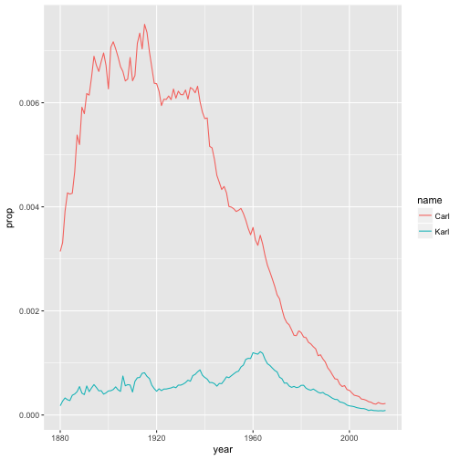

Load libraries


```r
library(babynames)
```

First few rows of the babynames data


```r
head(babynames)
```

```
## # A tibble: 6 x 5
##    year   sex      name     n       prop
##   <dbl> <chr>     <chr> <int>      <dbl>
## 1  1880     F      Mary  7065 0.07238433
## 2  1880     F      Anna  2604 0.02667923
## 3  1880     F      Emma  2003 0.02052170
## 4  1880     F Elizabeth  1939 0.01986599
## 5  1880     F    Minnie  1746 0.01788861
## 6  1880     F  Margaret  1578 0.01616737
```

Filter out Karl and Carl


```r
library(dplyr)
karl <- babynames %>% filter(name=="Karl" | name=="Carl", sex =="M")
```

Here is a plot of the Karls


```r
library(ggplot2)
karl %>% ggplot(aes(x=year, y=prop, color=name)) + geom_line()
```



